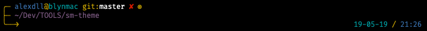
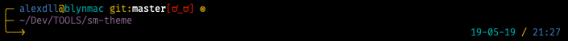

# sm-theme

<a href="https://github.com/blyndusk/sm-theme/releases/latest"></a>

<a href="https://github.com/blyndusk/sm-theme/blob/master/LICENSE"></a>


⛓ a **Simplist** & **Minimalist** theme for your **favorite** terminal.

## Install

### 1. via Oh-My-Zsh

1. Install `sm.zsh-theme` in  `~/.oh-my-zsh` folder:

```bash
# at the root of this repository
> source install.sh
```

2. Update `ZSH_THEME` theme in your `.zshrc`

```bash
21    # See https://github.com/robbyrussell/oh-my-zsh/wiki/Themes
22    ZSH_THEME="sm" # probably was ZSH_THEME="robbyrussell (default)
23
24    # Set list of themes to pick from when loading at random
```

## Custom

> By default, smileys are enabled & there are 3 lines

### 1. Smileys

#### Without smileys

```bash
13    local with_smileys=0;
```



#### With smileys

```bash
13    local with_smileys=1;
```



### 2. Lines

#### With two lines

```bash
16    local prompt_lines=2;
```


#### With three lines

```bash
16    local prompt_lines=3;
```


## Curated List

- [oh-my-zsh themes](https://github.com/robbyrussell/oh-my-zsh/wiki/Themes)
- [oh-my-zsh external themes](https://github.com/robbyrussell/oh-my-zsh/wiki/External-themes)
- [awesome-zsh-plugins](https://github.com/unixorn/awesome-zsh-plugins)

## License

Under [MIT](https://github.com/blyndusk/sm-theme/blob/master/LICENSE) license.