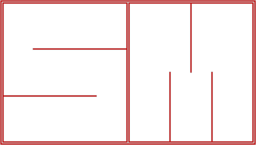
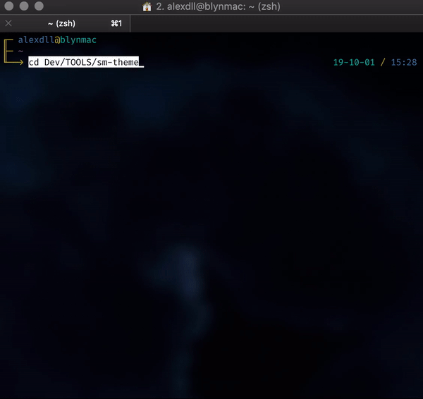
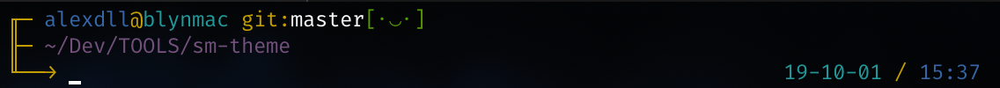
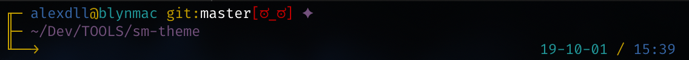
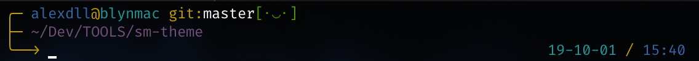
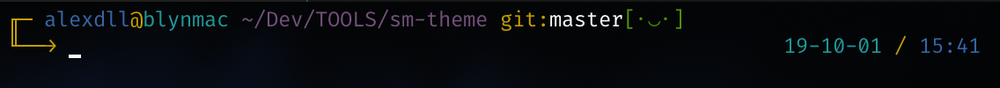

# sm-theme

<a href="https://github.com/blyndusk/sm-theme/releases/latest"></a>

<a href="https://github.com/blyndusk/sm-theme/blob/master/sm.zsh-theme"></a>
<a href="https://github.com/blyndusk/sm-theme/blob/master/LICENSE" alt="sm license"></a>
<a href="https://github.com/blyndusk/sm-theme" alt="sm license"></a>

⛓ **sm-theme** is a **Simplistic** & **Minimalist** theme for **`ZSH`** prompts.



> ⚠️ This theme better fit with **Fira Code** font.

## I - Install

### Oh-My-Zsh

If you're using [Oh-My-Zsh](https://github.com/robbyrussell/oh-my-zsh):

1. Clone this repository:

```bash
git clone https://github.com/blyndusk/sm-theme.git
```

2. Install `sm.zsh-theme` in  `~/.oh-my-zsh/` folder:

```bash
# at the root of this repository
> source install.sh --zsh
```

3. Update `ZSH_THEME` theme in your `.zshrc`

```bash
21    # See https://github.com/robbyrussell/oh-my-zsh/wiki/Themes
22    ZSH_THEME="sm" # probably was ZSH_THEME="robbyrussell (default)
23
24    # Set list of themes to pick from when loading at random
```

### Antigen

If you're using [Antigen](https://github.com/zsh-users/antigen):

1. Add `antigen bundle blyndusk/sm-theme` to your `.zshrc` where you've listed your other plugins.
2. Close and reopen your Terminal/iTerm window to **refresh context** and use the plugin. Alternatively, you can run `antigen bundle blyndusk/sm-theme` in a running shell to have `antigen` load the new plugin.

### zgen

If you're using [zgen](https://github.com/tarjoilija/zgen):

1. Add `zgen load blyndusk/sm-theme` to your `.zshrc` along with your other `zgen load` commands.
2. `zgen reset && zgen save`

## II - Customization

To custom this theme, there is **three** configuration variables:

- `SM_SMILEYS`: enable or disable **smileys**
- `SM_CORNERS`: enable or disable **corners**
- `SM_MULTILINES`: enable or disable **multilines**

By default, **all features are *enabled***.

```bash
# SM_SMILEYS=1 => with smileys, using "[ಠ_ಠ]" & "[･‿･]"
# SM_SMILEYS=0 => without smileys, using "✘" & "✔︎"
SM_SMILEYS=1

# SM_CORNERS=1 => the prompt's corner aren't rounded: "╭"
# SM_CORNERS=0 => the prompt's corner are rounded: "╓"
SM_CORNERS=1

# SM_MULTILINES=1 => the prompt is displayed on 3 lines
# SM_MULTILINES=0 => the prompt is displayed on 2 lines
SM_MULTILINES=1
```

### 1. Smileys

#### With smileys

```bash
07   SM_SMILEYS=1
```




#### Without smileys

```bash
07   SM_SMILEYS=0
```


### 2. Corners

#### With corners

```bash
11   SM_CORNERS=1
```


#### Without corners ( rounded )

```bash
11   SM_CORNERS=0
```



### 3. Multiline

#### With mutliline ( on 3 lines )

```bash
15   SM_MULTILINES=1
```


#### Without mutliline ( on 2 lines )

```bash
15   SM_MULTILINES=0
```



## III - Curated List

- [oh-my-zsh themes](https://github.com/robbyrussell/oh-my-zsh/wiki/Themes)
- [oh-my-zsh external themes](https://github.com/robbyrussell/oh-my-zsh/wiki/External-themes)
- [awesome-zsh-plugins](https://github.com/unixorn/awesome-zsh-plugins)

## IV - License

Under [MIT](https://github.com/blyndusk/sm-theme/blob/master/LICENSE) license.
