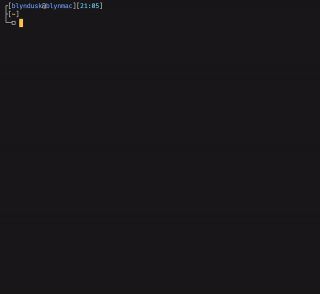

# sm-prompt

<a href="https://github.com/blyndusk/sm-prompt/releases/latest"></a>

<a href="https://github.com/blyndusk/sm-prompt/blob/master/sm.zsh-theme"></a>
<a href="https://github.com/blyndusk/sm-prompt/blob/master/LICENSE" alt="sm license"></a>
<a href="https://github.com/blyndusk/sm-prompt" alt="sm license"></a>

⛓ **sm-prompt** is a **Simplistic** & **Minimalist** theme for **`Bash`** and **`Zsh`** prompts.



> This theme better fit with **Fira Code** font.

## I - Install

```bash
source ./install.sh
```

This [script](https://github.com/blyndusk/sm-prompt/blob/master/install.sh) will:
- **select** your actual shell (`Bash|Zsh`) according to your **flag**
- **copy** the theme file into your **user root** (`~`)
- **check** for a `.[ba|z]shrc` file to **source** the theme file
- **replace** your actual prompt theme with the **sm** one

### Bash

```bash
source ./install.sh --bash
```

### Zsh

```zsh
source ./install.sh --zsh
```

## IV - License

Under [MIT](https://github.com/blyndusk/sm-prompt/blob/master/LICENSE) license.
